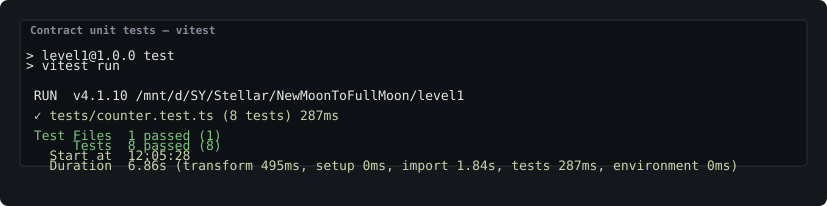
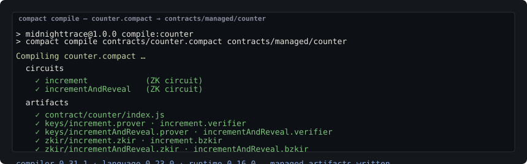
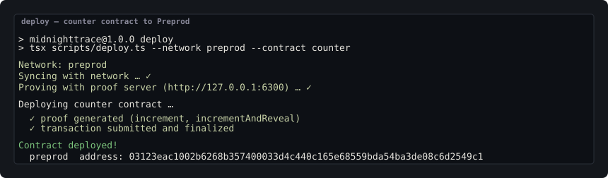
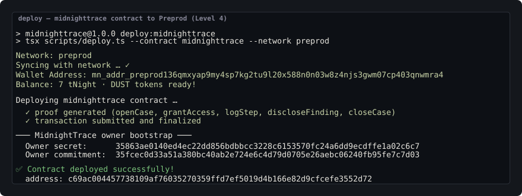

# MidnightTrace — Private Blockchain Forensics on Midnight


## 📄 Docs (Level 5 — User Validation)

| Doc | What it is |
|-----|-----------|
| [**FEEDBACK.md**](./FEEDBACK.md) | Level 5 feedback log — form, raw feedback, themes, changes |
| [**USERS.md**](./USERS.md) | Preprod user tracker — verified wallet addresses (5 / 50) |

> A privacy-first forensics dApp on the Midnight Network: an on-chain counter
> that proves each forensic step (a hidden amount) without ever revealing the
> amount itself, grown into a full case-management and private-audit system.
> Built across four levels — the Compact contract (Level 1), the full-stack
> dApp (Level 2), the deployed, CI-covered submission (Level 3), and the
> multi-case, selectively-disclosable, publicly-auditable investigation desk
> (Level 4).

## Live Demo

- **Live Link:** https://midnighttrace.vercel.app
- **Demo video :** https://drive.google.com/file/d/1bOeonY699oXLjS_eNTHpgxTeijhwt9vF/view?usp=sharing

> Runs the complete dApp: wallet + on-chain calls, the multi-page React frontend,
> and the Express API (`/api/health`, `/api/cases`, `/api/stats`, …). Deployed
> from the repo root via the included `vercel.json`.

## Contract Address

| Network  | Contract address                                                  | Contract |
|----------|-------------------------------------------------------------------|----------|
| Preprod  | `03123eac1002b6268b357400033d4c440c165e68559bda54ba3de08c6d2549c1` | Counter (Levels 1–3) — Live demo |
| Preprod  | `c69ac004457738109af76035270359ffd7ef5019d4b166e82d9cfcefe3552d72` | MidnightTrace (Level 4) |
| Preview  | `e86050af934fed3ed7d6e8dfab05a7198d4d91521b68279ecaccd26e68d4ffb6` | Counter (Level 1) |

> The Level 4 MidnightTrace address is added to this table **and** to
> `src/config.ts` (`MIDNIGHTTRACE_CONTRACT_ADDRESS`) right after the deploy.

## Level 5 — User Validation

- Target: 50 Preprod users
- Current: 5 / 50 (see [USERS.md](./USERS.md))
- See [USERS.md](./USERS.md) for wallet addresses
- See [FEEDBACK.md](./FEEDBACK.md) for the feedback log and changes

## What This Product Does

MidnightTrace is a **private blockchain forensics desk**. Real forensic work
demands proof: an examiner must attest that they counted evidence, traced a
hidden amount, ran a batch, or sealed a case — without leaking the underlying
evidence. This dApp turns each step into a on-chain **zero-knowledge proof** so
the work is independently verifiable while the data stays shielded.

The intended users are forensic investigators, compliance officers, and
auditors. Investigators run each analysis step through a Midnight circuit whose
proof lands on-chain; auditors then verify the proofs and the running totals
with **no wallet and no secrets** via the public Audit window. Midnight is the
right platform because Compact smart contracts support **selective
disclosure natively**: the ledger holds only the public running totals, while
the witnesses behind them (step amounts, member identities) are proved in ZK
and then dropped — provable work without surveillance.

## Project Vision

In real-world forensic work you often need to *prove that you performed an
analysis step* — traced a hidden transaction amount, counted evidence items,
verified a batch size — without disclosing the underlying data. MidnightTrace
gives auditors, compliance officers, and forensic analysts exactly that:
each forensic step runs through a Midnight circuit whose proof lands on-chain,
while the amount that backs the proof stays private forever.

Midnight is the core of this because its Compact smart contracts run
*selective disclosure* natively: the ledger holds only the public running
`total`, while the witness that backs it (the `amount`) is proved in
zero-knowledge and then dropped. The DApp is delivered level-wise against the
official *New Moon to Full: Monthly Moonshots on Midnight* builder-program
requirements.

### Level 1 — New Moon · Setup & First Contract

> Official requirements: **toolchain setup, a first Compact contract, deployed
> on Preview/Preprod, and a seeded initial idea.**

| Requirement | Status | Evidence |
|---|---|---|
| Midnight toolchain set up | ✅ | Node v22, npm, Compact compiler (compact 0.5.1) via `npm run compile`, Docker Desktop + local proof server (`docker compose up -d --wait proof-server`) |
| First Compact contract written | ✅ | `contracts/counter.compact` — two circuits: `increment`, `incrementAndReveal` |
| Contract deployed on Preprod | ✅ | Counter at `03123eac…` (see **Contract Address**) |
| Initial idea seeded | ✅ | Product proposal in `PROPOSAL.md` — a privacy-first blockchain forensics desk |

The Level 1 contract itself:

- `increment(amount)` advances the public counter `total` by the given amount —
  but the amount is a **private witness** that is never stored on-chain.
- `incrementAndReveal(amount)` does the same arithmetic but *deliberately*
  publishes the amount into the public `lastDisclosed` ledger field via
  `disclose()`.

Both share the same arithmetic; the only difference is whether the caller
chooses to keep the amount private or reveal it. This is the core Midnight
pattern — selective disclosure — applied to the smallest meaningful contract.

### Level 2 — Waxing Crescent · Frontend Integration

> Official requirements: **contract wired to a frontend UI, Lace connected on
> Preprod.**

| Requirement | Status | Evidence |
|---|---|---|
| Contract wired to a frontend UI | ✅ | Multi-page React 19 + Vite app drives both circuits from `src/hooks/useMidnight.ts` |
| Wallet connected on Preprod | ✅ | 1AM / Lace via the DApp Connector, `VITE_NETWORK_ID=preprod`, network validated in `useMidnight` |
| Circuit runnable from the UI | ✅ | `increment(amount)` with a **private witness**; proof generated in-browser, submitted on-chain, attached to a case as a receipt |

The Level 2 app puts the contract to work:

1. Browse **Cases** — forensic cases stored server-side, each tracking its own
   proof receipts against the one deployed counter contract.
2. Connect your Midnight wallet (**1AM** or **Lace**) on **Preprod**.
3. **Run the circuit** — `increment(amount)` is called with a **private witness
   amount**. A zero-knowledge proof is generated in the browser proving
   `total' = total + amount`, and the proof is submitted on-chain.
4. The public ledger updates (`total` increases), but the hidden `amount` never
   lands on-chain and never appears in the UI nor the API — it exists only
   inside the ZK proof. The proof is attached to the current case as a receipt.

Pages: **Dashboard** (`/`), **Cases** (`/cases`), **Case detail** (`/cases/:id`),
**New case** (`/new`), **About** (`/about`).

### Level 3 — First Quarter · Production-Grade dApp

> Official requirements: **a polished dApp, tests, CI/CD, and a problem chosen
> from the provided list.**

| Requirement | Status | Evidence |
|---|---|---|
| Polished dApp | ✅ | Single unified repo (contracts, CLI scripts, API, frontend), full multi-page UI, live on Vercel at `https://midnighttrace.vercel.app` |
| Tests | ✅ | 21 contract unit tests (Vitest) + ZK-asset smoke + Express API smoke (`npm run test`) |
| CI/CD | ✅ | Two-job GitHub Actions pipeline (`.github/workflows/ci.yml`) on push/PR |
| Problem chosen from the provided list | ✅ | Private, verifiable compliance/forensics proofs — **MidnightTrace** (see `PROPOSAL.md`) |

### Idea Submission — The Turn

> Official requirements: **submit the idea against the problem statement; commit
> once approved.**

| Requirement | Status | Evidence |
|---|---|---|
| Idea submitted against the problem statement | ✅ | `PROPOSAL.md` — idea, target users, Midnight rationale, data model, mainnet feasibility |
| Idea committed after approval | ✅ | This repo (`NewMoonToFullMoon`) is the committed build of the approved **MidnightTrace** idea |

### Level 4 — Waxing Gibbous · MVP Goes Live

> Official requirements: **MVP live on Preprod, documentation, CI/CD in place,
> and a public product (X) profile.**

| Requirement | Status | Evidence |
|---|---|---|
| MVP live on Preprod | ✅ | `midnighttrace.compact` deployed at `c69ac004…` (see **Contract Address**); live dApp at `https://midnighttrace.vercel.app` |
| Documentation | ✅ | This README, `docs/USAGE.md` (non-technical walkthrough), `docs/posts.md`, `PROPOSAL.md` |
| CI/CD in place | ✅ | GitHub Actions badge below (contract + frontend jobs, both passing) |
| Public product (X) profile | ✅ | [x.com/Midnight__Trace](https://x.com/Midnight__Trace) — live profile with launch threads (see below) |

`contracts/midnighttrace.compact` replaces the single counter with a whole
investigation desk, still private by default. Its five circuits:

- `openCase(caseId)` — start a number-addressed case file.
- `grantAccess(newCommitment, secret)` — an allowlisted member authorizes a new
  investigator *without ever revealing who*. Member secrets and step amounts
  never go on-chain.
- `logStep(caseId, amount, secret)` — record a hidden movement. The case
  `total` rises by the private `amount`.
- `discloseFinding(caseId, amount, secret)` — *selective disclosure*: publish
  the running total you choose into the public `lastDisclosed` column.
- `closeCase(caseId, secret)` — seal the case so its totals become permanent.

Membership is a **private allowlist**: the ledger stores only commitments
(`persistentHash` of each member's secret) in a Merkle tree. Proving membership
is a zero-knowledge proof that your secret opens a live leaf — the on-chain
root is compared, never the identity.

Level 4 also ships:

- **Chain-of-custody timeline** per case: every proof is filed in finalization
  order with its `txId`, block height, and step type, so custody is
  independently verifiable.
- **Multi-case management** — many case files, one contract, one aggregate.
- **Freshness & integrity attestations** — `closeCase` seals totals; the
  **Public audit window** (`/audit`) lets *anyone*, wallet-free, read the live
  on-chain ledger straight from the Midnight indexer and verify the aggregate,
  per-case totals, phase, allowlist root, and disclosure book.
- **Receipt export** — every case can be exported to a JSON chain-of-custody
  record.

Additional pages: **Audit** (`/audit`).

### Level 5 — Full Moon · Users & Feedback (roadmap)

> Official requirements: **the same MVP, docs, a living feedback loop, and 50
> Preprod users.**

| Requirement | Status | Evidence |
|---|---|---|
| Same MVP + docs | ✅ | Already live (Level 4) — the MVP and docs carry forward unchanged |
| Living feedback loop | 🚧 | In progress — `FEEDBACK.md` created (collection method, raw log, themes, changes); waiting on real user feedback |
| 50 Preprod users | 🚧 | In progress — `USERS.md` tracks verified wallet addresses (5/50); outreach messages drafted (Discord/Telegram, X, direct DM) |

### Level 6 — Supermoon · Mainnet Launch (roadmap)

> Official requirements: **deploy to Mainnet, iterate on feedback, brand assets,
> and 20 real users onboarded.**

| Requirement | Status | Evidence |
|---|---|---|
| Mainnet deployment | 🚧 | Automated deploy scripts already exist (`npm run deploy` / `npm run deploy:midnighttrace`); mainnet path detailed in `PROPOSAL.md` → **Mainnet Feasibility** |
| Iterate on feedback | 🚧 | Depends on the Level 5 feedback loop |
| Brand assets | 🚧 | Roadmap item |
| 20 real users onboarded | 🚧 | Roadmap item |

## Contract Deployment

The live addresses (Counter + MidnightTrace, per network) are listed in the
**Contract Address** table near the top of this file and baked into
`src/config.ts`. Anyone can query the contracts' public state straight from the
Preprod indexer and see the running totals and the allowlist root — but never
the amounts or the identities behind them.

## What an on-chain observer sees

| Goes on chain (public)                    | Stays private (proved in ZK, then dropped) |
|-------------------------------------------|--------------------------------------------|
| `ledger.total` — running counter value    | `amount` — the witness of each circuit |
| `ledger.lastDisclosed` — amounts a caller deliberately published via `incrementAndReveal` (left at `0` in the private path) | the connection between a case and its evidence amounts |
| MidnightTrace: the `cases` map (caseId → total, lastDisclosed, eventCount, phase), the single `aggregate`, the allowlist `memberCount`, and the allowlist Merkle root | the step amounts and every member secret — only their `persistentHash` commitments are ever stored |
| receipt `txId` / `blockHeight` (off-chain metadata pointing at the public tx) | case description/owner (off-chain metadata only) |

## Privacy model

- **What is PUBLIC (on-chain, visible to anyone):**
  - `ledger total` — the running counter value. Every call produces a publicly
    visible new value.
  - `ledger lastDisclosed` — the most recent step amount that a caller
    deliberately published via `incrementAndReveal`.
  - MidnightTrace: per-case `total` / `lastDisclosed` / `eventCount` / `phase`,
    the global `aggregate`, the allowlist root, and `memberCount`.
- **What is PRIVATE (private witness, never on-chain):**
  - The `amount` argument of each circuit. It exists only in the caller's ZK
    witness and is fed into the circuit; unless a circuit explicitly
    `disclose()`s it, the amount never appears in the ledger. The Compact
    compiler rejects any implicit disclosure.
  - Member secrets. Only their `persistentHash` commitments live in the
    allowlist tree.
- **What the user PROVES without revealing:**
  - That the new `total` honestly equals the previous `total` plus the hidden
    `amount` — without the network or anyone else learning the `amount` — and,
    in MidnightTrace, that the caller's secret opens a leaf of the on-chain
    allowlist tree (a Merkle membership proof).

### Privacy claim

To an on-chain observer, MidnightTrace shows: a transaction was submitted that
moved the public `total` counter by exactly the hidden amount, and the proof
was cryptographically valid. The `amount` itself is not a ledger field, is not
part of the public transcript, and is never rendered in the UI. A
fork-and-diff comparison against `incrementAndReveal` proves the difference:
the reveal path writes the amount to `lastDisclosed`; the private path leaves
it nowhere on-chain.

### Threat model

| Threat | Mitigation in MidnightTrace |
|--------|-----------------------------|
| Compromised API server | The server never sees the private witness — proofs are generated for a connected wallet (1AM sponsors proving + fees) or delegated to a proof server. A compromised API leaks case metadata and public totals only. |
| Malicious indexer / RPC | A hostile indexer sees only public ledger state — the `total` and any `lastDisclosed`. It cannot see the `amount`; the ZK proof proves the claims without revealing witnesses. |
| Fake claims | Circuits are fail-closed: a proof asserting `total' = total + amount` for a false amount fails. A non-deliberate witness amount never lands in public ledger state (enforced by the 8-test suite, including privacy tests). |

## Key features

- **Three levels of tooling**: Compact contract sources + compiled
  artifacts (`contracts/managed/`), a CLI script set (`scripts/`: setup,
  deploy, cli, counter-demo, check-balance, network, e2e-check), and the
  full-stack web app.
- **Zero-knowledge selective disclosure** — public `total` plus an optional
  deliberate `lastDisclosed`; the `amount` never crosses the proof boundary.
- **Private allowlist membership (Level 4)** — MidnightTrace stores only
  hashes of member secrets and proves membership in zero knowledge; the owner
  boots the tree at deploy and grants access without ever revealing who.
- **Multi-case management (Level 4)** — number-addressed case files on one
  contract, reconciled against a single on-chain aggregate.
- **On-chain proof receipts per case** — each circuit call is recorded against a
  forensic case via the Express API (`/api/cases`, `/api/cases/:id/receipts`,
  `/api/stats`); receipt exports keep a verifiable chain of custody.
- **Public audit window (Level 4)** — `/audit` reads the live on-chain ledger
  with no wallet and cross-checks aggregate, totals, phases, allowlist root,
  and the disclosed-finding receipt book.
- **DApp Connector wallet integration** — `useMidnight` connects a 1AM or Lace
  wallet, validates the network, and drives the circuit from the shared
  `MidnightContext`.
- **In-browser proving** — ZK config is fetched from the bundled assets
  (`/contract/compiled/`), and proofs are generated by the wallet's proving
  provider (or its proof-server fallback).
- **Privacy-labelled prove flow** — every ZK action states the private step
  never reaches the chain or the screen.

## Tech stack

- Midnight Network
- Compact smart contract language (`counter.compact`, `midnighttrace.compact`,
  compiled artifacts + ZK keys under `contracts/managed/`)
- Midnight.js SDK (`@midnight-ntwrk/midnight-js` 4.1.1 — indexer public data
  provider, level private state provider, fetch ZK config provider, ledger-v8)
- DApp Connector API (`@midnight-ntwrk/dapp-connector-api`)
- React 19 + Vite + TypeScript
- React Router 7 (multi-page navigation)
- Express 5 (backend API: cases, receipts, stats; serves the built frontend)
- 1AM or Lace wallet (browser extension)
- Vitest (contract tests), GitHub Actions (CI)

## Prerequisites

- **Node.js v22+** (the repo pins `engines.node >= 22.0.0`)
- **npm** (comes with Node)
- **Docker Desktop** with the Linux engine running — the local **proof server**
  (`docker compose up -d --wait proof-server`) is required for contract deploys
  and the CLI, and optional for the demo (the browser wallet can delegate
  proving instead)
- **A Midnight wallet** — the **1AM** or **Lace** browser extension on
  **Preprod**
- **tNIGHT + DUST** — fund your deploy wallet from the network faucet
  (`https://faucet.preprod.midnight.network`)

## Setup & Run Locally

```bash
# 1. Install dependencies (root package.json covers contracts, scripts, frontend)
npm install

# 2. Configure the Preprod contract address (set VITE_CONTRACT_ADDRESS if yours
#    differs). Default in src/config.ts already points to the Preprod address.
cp .env.example .env   # edit .env and paste your address if needed

# 3. Run the whole stack (API on :4000 + web on :5173)
npm run dev
# open the printed URL, connect your wallet (1AM or Lace) on Preprod,
# browse Cases, and run the circuit

# 4. Contract app (Levels 1 + 4) — compile + tests
npm run compile
npm run test:contract

# 5. Production build — the Express server serves dist/ + API together
npm run build
npm start   # http://localhost:4000

# 6. Level 4 — deploy the midnighttrace contract (prints the owner secret;
#    paste that address and secret into .env after the deploy)
npm run deploy:midnighttrace -- --network preprod
```

### Contract app (Levels 1 + 4) — local proof server & deploy

```bash
# 1. Start the proof server (pins the SDK-compatible proof-server image)
docker compose up -d --wait proof-server

# 2. Compile the contracts into contracts/managed/
npm run compile

# 3. Deploy the counter contract to a network (prints your wallet address —
#    fund it at the faucet first, then it continues)
npm run deploy -- --network preprod --contract counter

# 4. Deploy the midnighttrace contract. The deployer secret + commitment are
#    printed — keep the secret, and bootstrap the dApp with them:
npm run deploy:midnighttrace -- --network preprod
```

Environment (`.env`, built-in defaults in `src/config.ts`):

| Variable | Meaning |
|----------|---------|
| `VITE_CONTRACT_ADDRESS` | Counter contract address (Preprod) |
| `VITE_MIDNIGHTTRACE_CONTRACT_ADDRESS` | MidnightTrace contract address (Preprod) — paste the deployed address |
| `VITE_MIDNIGHTTRACE_OWNER_SECRET` | 64-hex owner secret printed at deploy — lets your wallet act as the case owner |
| `VITE_NETWORK_ID` | `preprod` (default) / `preview` / `undeployed` |
| `VITE_PROOF_SERVER_URI` | Optional: point proving at the local proof server |

Notes:

- Deployment records are stored in `.midnight-state.json` (gitignored).
- Wallet seeds per network are in `.midnight-state.json`; the wallet sync cache
  lives in `.midnight-wallet-state/` (gitignored).
- Use `npm run clean` to remove generated artifacts and reset local state.

## Run Tests

```bash
# Contract unit tests (circuit logic, state transitions, privacy) — 21 tests
npm run test:contract

# Frontend build + ZK smoke test + API smoke test
npm run test:frontend
```

Output (contract tests):

```
> midnighttrace@1.0.0 test:contract
> vitest run

 ✓ tests/counter.test.ts (8 tests) 163ms
 ✓ tests/midnighttrace.test.ts (13 tests) 904ms

 Test Files  2 passed (2)
      Tests  21 passed (21)
 ```

The 13 midnighttrace tests cover: owner allowlist bootstrap, deterministic
ledger projection, open/duplicate cases, hidden-amount `logStep` (the amount is
never disclosed), chain-of-custody ordering, `discloseFinding` selective
disclosure, non-member rejection, member-grant `grantAccess`, non-member grant
rejection, multi-case isolation + aggregate reconciliation, `closeCase` sealing,
and the on-chain storage of commitments only (never secrets).

Output (frontend tests):

```
✓ ZK assets ship in dist/          (tests/smoke.mjs)
✓ API healthy (7 endpoint checks)  (tests/api-smoke.mjs)
```

Screenshot of the contract test output:



Screenshot of the Compact compile output (circuits + artifacts listed):



Screenshot of the Preprod deployment (counter, Levels 1–3):



Screenshot of the Level 4 MidnightTrace deployment (address + owner bootstrap):



## Usage Guide

The full, non-technical walkthrough of the Level 4 investigation desk lives in
[`docs/USAGE.md`](./docs/USAGE.md) — how to open case files, log hidden steps,
disclose findings on your terms, manage the private allowlist, run the
wallet-free public audit, and export a chain-of-custody receipt.

## Product X Profile

- **Profile:** https://x.com/Midnight__Trace
- **Launch post:** https://x.com/Midnight__Trace/status/2087846984195752357
- **Privacy post:** https://x.com/Midnight__Trace/status/2087847565182341337
- **Auditor post:** https://x.com/Midnight__Trace/status/2087848209230262538

The full set of launch threads lives in [`docs/posts.md`](./docs/posts.md).

## Deploy to Vercel

The repo ships a [`vercel.json`](./vercel.json) config that deploys
the full-stack app: the Vite frontend as static output (`dist/`) plus the Express
API as a serverless function (`api/index.mjs`), with `/api/*` rewired to
the function and all other routes falling back to the SPA.

1. Push this repo to GitHub (it is already public) and import it into Vercel.
2. Leave the root directory at the repo root and set the framework preset to **Vite**.
3. Add env vars: `VITE_NETWORK_ID=preprod` and `VITE_CONTRACT_ADDRESS`
   (secret) set to the Preprod address above.
4. Deploy. Vercel builds `npm install && npm run build` and serves both the
   static site and the `/api/*` endpoints.

> The default data store is a JSON file in the function's writable dir; Vercel
> serverless storage is ephemeral, so case data reseeds on each cold start. For
> persistence, set `MIDNIGHTTRACE_DATA_FILE` to an external store or a Vercel
> Blob/MySQL connection.

## Mainnet path

The dApp needs, on mainnet: the same `counter.compact` and
`midnighttrace.compact` deployed at a higher security threshold
(`npm run deploy` / `npm run deploy:midnighttrace` are already automated), the
mainnet indexer endpoints in `src/config.ts`, wallet-delegated proving (already
the flow), a persistent host for the Express API, and 1AM / Lace on mainnet via
the network-agnostic DApp Connector flow. Full detail in **PROPOSAL.md**.

## Future scope

- Encrypted evidence hashes and auditor access keys on the case store.
- Retention/expiry timestamps and multi-signature handoff records.
- Cross-case sub-audits and a shared "evidence ledger" that several
  investigation desks can write to under the same private-allowlist model.

## CI/CD

A GitHub Actions pipeline runs on every push to `main` and on every pull
request. The workflow lives at `.github/workflows/ci.yml` and runs two jobs:

1. **contract** — installs the Compact compiler, compiles `counter.compact`,
   `hello-world.compact`, and `midnighttrace.compact`, and runs the 21 contract
   unit tests.
2. **frontend** — installs dependencies, runs the production Vite build, and
   runs both the ZK-asset smoke test and the Express API smoke test.

Status badge: 

## Project structure

```
NewMoonToFullMoon/
├── .github/workflows/ci.yml     # CI/CD pipeline (push main + PR)
├── PROPOSAL.md                  # product proposal (idea, users, data model, mainnet feasibility)
├── USERS.md                     # Level 5 preprod user log (target 50 wallet addresses)
├── FEEDBACK.md                  # Level 5 feedback log (method, raw log, themes, changes)
├── README.md
├── contracts/                   # Compact sources + compiled artifacts
│   ├── counter.compact          #   Level 1 counter (increment / incrementAndReveal)
│   ├── midnighttrace.compact    #   Level 4 investigation desk (5 circuits + private allowlist)
│   ├── hello-world.compact
│   └── managed/                 #   compiled contract artifacts + ZK keys
├── docs/
│   └── USAGE.md                 # step-by-step user guide
├── api/index.mjs                # Express API entry (serverless for Vercel)
├── server/index.mjs             # Express API (cases, receipts, stats) + prod static hosting
├── scripts/                     # CLI: setup, deploy, network, wallet, demo, e2e-check
├── src/
│   ├── components/              # Layout (nav + wallet pill), CircuitCall
│   ├── context/                 # MidnightProvider (shared wallet/contract state)
│   ├── hooks/                   # useMidnight.ts (connect, join both contracts, run circuits)
│   ├── lib/                     # api client, providers, wallet adapter, ledger, types, membership
│   ├── pages/                   # Dashboard, Cases, CaseDetail, CreateCase, Auditor, About
│   ├── App.tsx                  # React Router routes
│   ├── main.tsx
│   └── config.ts                # Counter + MidnightTrace Preprod addresses
├── tests/                       # counter + midnighttrace unit tests, simulators, ZK + API smoke
├── screenshots/                 # test-output screenshot for the submission
├── vercel.json                  # Vercel full-stack deploy config
├── docker-compose.yml           # local proof server for Level 1
└── package.json
```

## Companion docs

| Doc | Use when |
|-----|----------|
| `PROPOSAL.md` | Product proposal — idea, users, Midnight rationale, data model, mainnet feasibility |
| `USERS.md` | Level 5 preprod user log — verified wallet addresses (target 50) |
| `docs/USAGE.md` | Step-by-step user guide for the Level 4 investigation desk |
| `FEEDBACK.md` | Level 5 feedback log — collection method, raw log, themes, changes |
| `docs/posts.md` | The three X/Twitter promo posts for the Level 4 submission |
| `screenshots/contract-tests.svg` | Test-output screenshot (21 tests passing) |
| `screenshots/midnighttrace-deployed.svg` | Level 4 MidnightTrace deploy (address + owner bootstrap) |
| `.github/workflows/ci.yml` | CI/CD pipeline with passing runs |
